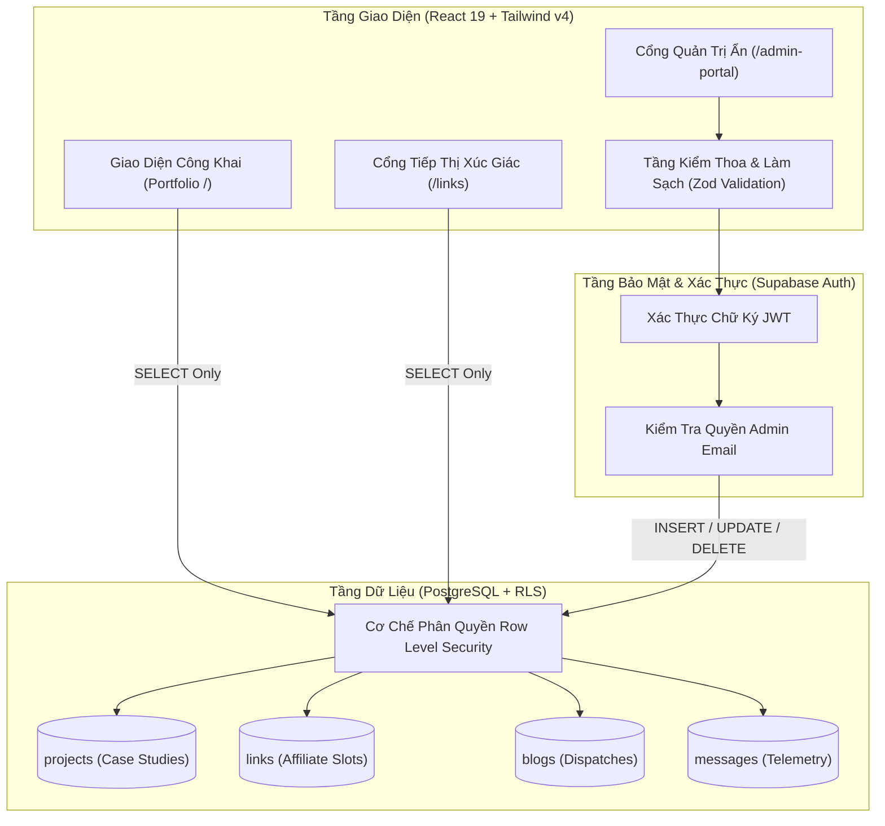

# KNOWLEDGE ITEMS (KIs): HYBRID PORTFOLIO & BIO LINK ARCHITECTURE
> **Tài liệu Đặc tả Kỹ thuật, Nhật ký Kiến trúc & Hướng dẫn Vận hành Toàn diện**  
> *Dự án:* Hybrid Personal Website (Portfolio + Bio Link / Affiliate Hub)  
> *Phiên bản:* `v2.4 VI-EN` | *Mã phân hệ:* `CHASSIS SPEC M-2026`  
> *Thời gian hoàn thiện:* Tháng 9/2026 | *Trạng thái:* Sẵn sàng Triển khai (Production-Ready)

---

## 1. TỔNG QUAN DỰ ÁN & MỤC TIÊU KIẾN TRÚC (PROJECT OVERVIEW)

Dự án là một **Nền tảng Kép (Hybrid System)** phục vụ đồng thời hai mục tiêu chiến lược:
1. **Hồ sơ Năng lực Kỹ sư (Professional Engineering Portfolio):** Trình bày các bài toán thực tế (Case Studies), kiến trúc giải pháp, ma trận kỹ năng và nền tảng học thuật với tính thuyết phục cao.
2. **Cổng Tiếp thị Liên kết Xúc giác (Bio Link / Affiliate Conversion Hub):** Đường dẫn tối ưu hóa di động (`/links`), tốc độ tải dưới 50ms, theo dõi số lượt click và tối đa hóa tỷ lệ chuyển đổi thiết bị công nghệ.



---

## 2. KIẾN TRÚC BẢO MẬT 4 TẦNG (4-LAYER DEFENSE ARCHITECTURE)

Do Frontend kết nối trực tiếp với Supabase qua Web Browser, mã khóa `Anon Key` hiển thị công khai trên network request. Hệ thống áp dụng **4 Lớp Phòng Thủ Chiều Sâu**:

### Lớp 1: Đường Dẫn Quản Trị Ẩn & Xác Thực OAuth (`/admin-portal`)
- Không để nút "Đăng nhập" trên giao diện công khai để tránh bị brute-force và quét bot.
- Tích hợp Supabase OAuth (Google / GitHub) và xác thực qua Token/Mật khẩu an toàn.
- Quản lý phiên làm việc thông qua JWT SHA-256 mã hóa trực tiếp trong trình duyệt.

### Lớp 2: Ma Trận Phân Quyền Dữ Liệu PostgreSQL Row Level Security (RLS)
Mọi bảng dữ liệu đều bật `ENABLE ROW LEVEL SECURITY`. Anon Key bị chặn hoàn toàn quyền ghi đè:

| Bảng Dữ Liệu | Quyền Người Dùng Công Khai (`anon`) | Quyền Quản Trị Viên (`authenticated + is_admin`) | Cơ Chế Kiểm Tra Điều Kiện |
| :--- | :---: | :---: | :--- |
| `projects` | **Chỉ `SELECT`** | **Toàn quyền (`ALL`)** | `auth.jwt() ->> 'email' = 'admin_email'` |
| `links` | **Chỉ `SELECT` (`is_active = true`)** | **Toàn quyền (`ALL`)** | `is_active = true OR public.is_admin()` |
| `blogs` | **Chỉ `SELECT` (`published = true`)** | **Toàn quyền (`ALL`)** | `published = true OR public.is_admin()` |
| `messages` | **Chỉ `INSERT`** (Không được đọc) | **`SELECT` & `DELETE`** | Giới hạn độ dài chuỗi chống spam payload |

#### Đoạn mã SQL RLS Trọng yếu:
```sql
-- Hàm kiểm tra quyền Admin tối cao
CREATE OR REPLACE FUNCTION public.is_admin()
RETURNS BOOLEAN AS $$
BEGIN
    RETURN (
        auth.role() = 'authenticated' 
        AND (
            auth.jwt() ->> 'email' = 'your-admin-email@domain.com'
            OR (auth.jwt() -> 'app_metadata' ->> 'role') = 'admin'
        )
    );
END;
$$ LANGUAGE plpgsql SECURITY DEFINER;

-- Chính sách chặn hoàn toàn thao tác phá hoại từ bên ngoài
CREATE POLICY "Admin full access on projects" 
ON public.projects FOR ALL 
TO authenticated 
USING (public.is_admin()) 
WITH CHECK (public.is_admin());
```

### Lớp 3: Kiểm Thoa Đầu Vào Phía Client (Zod) & Trigger Làm Sạch (Sanitization)
- Toàn bộ form nhập liệu tại `/admin-portal` và form liên hệ tại trang chủ đều được kiểm tra nghiêm ngặt qua [validations.js](file:///d:/personal%20project/client/src/lib/validations.js).
- Hàm `sanitizeString()` tự động khử toàn bộ thẻ HTML nguy hại (XSS prevention) trước khi dữ liệu được gửi đi.

### Lớp 4: Kiểm Soát Tần Suất & Chống Lạm Dụng (Rate Limiting)
- Tối ưu hóa click telemetry bằng cơ chế đếm lạc quan (Optimistic UI) kết hợp debounce.
- Áp dụng các ràng buộc kiểm tra ràng buộc `CHECK` độ dài trên PostgreSQL để chặn các payload ngoại cỡ gây nghẽn RAM.

---

## 3. HỆ THỐNG THIẾT KẾ CÔNG NGHIỆP XÚC GIÁC (INDUSTRIAL SKEUOMORPHISM)

Dự án tôn vinh phong cách **Industrial Realism** – kết hợp độ tin cậy cơ học, tính xúc giác và ngôn ngữ sản xuất phần cứng chuyên dụng.

### Bảng Mã Màu & Design Tokens ([index.css](file:///d:/personal%20project/client/src/index.css)):
- **Chassis Background (Level 0):** `#e0e5ec` (Vỏ máy ABS hoàn thiện mờ).
- **Panel Foreground (Level +1):** `#f0f2f5` (Mặt module điều khiển nổi).
- **Recessed Inset (Level -1):** `#d1d9e6` (Rãnh khoét chìm).
- **Safety Orange Accent:** `#ff4757` (Nút nhấn kích hoạt & Đèn báo động khẩn).
- **Chỉ số LED:** Xanh lá (`#2ed573`), Hổ phách (`#ffa502`), Đỏ cảnh báo (`#ff4757`).

### Đặc tả Chi Tiết Cơ Khí:
1. **Ốc Vít Góc M3 ([ScrewHead.jsx](file:///d:/personal%20project/client/src/components/common/ScrewHead.jsx)):** Gradient hướng tâm 45 độ với rãnh khắc phẳng hoặc chữ thập.
2. **Khe Tản Nhiệt Làm Mát ([VentSlots.jsx](file:///d:/personal%20project/client/src/components/common/VentSlots.jsx)):** Rãnh tản nhiệt chìm sâu đổ bóng cấu trúc.
3. **Phím Cơ Học Xúc Giác ([MechanicalButton.jsx](file:///d:/personal%20project/client/src/components/common/MechanicalButton.jsx)):** Khi nhấn sẽ dịch chuyển cơ học `translate-y-[2px]` kết hợp đảo chiều bóng đổ neumorphic, sử dụng đường cong lò xo Framer Motion:
   $$\text{Easing} = \text{cubic-bezier}(0.175, 0.885, 0.32, 1.275)$$
4. **Hiệu Ứng Quét Màn Hình CRT (`scanlines-overlay`):** Lưới quét vi mô mô phỏng màn hình điều khiển công nghiệp thập niên 90.

---

## 4. CHUẨN HÓA SONG NGỮ SONG SONG (VIETNAMESE - ENGLISH ARCHITECTURE)

Hệ thống tuân thủ cấu trúc hiển thị song ngữ đồng thời (Parallel Layout):
- **Tiếng Việt:** Ngôn ngữ diễn giải chính, rõ ràng, sâu sắc về năng lực chuyên môn và giải pháp kỹ thuật.
- **Tiếng Anh Kỹ Thuật (Subtext & Badges):** Đóng vai trò mã định danh phân hệ, thông số phần cứng, nhãn công nghệ quốc tế (ví dụ: `HỆ THỐNG // SYSTEM ONLINE`, `MÃ ĐỊNH DANH // UNIT #01`, `BÀI TOÁN & ĐIỂM NGHẼN // IDENTIFIED BOTTLENECK`).

---

## 5. NHẬT KÝ XỬ LÝ SỰ CỐ & GỠ LỖI (TROUBLESHOOTING & INCIDENT LOG)

Trong quá trình phát triển, các sự cố kỹ thuật sau đã được phát hiện, phân tích nguyên nhân gốc rễ (RCA) và xử lý triệt để:

### Sự cố 1: Tích hợp Tailwind CSS v4 với Vite Plugin
- **Hiện tượng:** Cấu hình Tailwind v3 truyền thống yêu cầu file `tailwind.config.js` và `postcss.config.js` cồng kềnh.
- **Giải pháp:** Nâng cấp sang `@tailwindcss/vite` trên Vite 8, khai báo `@import "tailwindcss";` trực tiếp trong `index.css` giúp tốc độ build đạt ~400ms và không phát sinh tệp cấu hình thừa.

### Sự cố 2: Lỗi Build do Thư Viện Lucide-React Loại Bỏ Brand Icons
- **Hiện tượng:** Các icon `Github`, `Youtube`, `Twitter` trong bản `lucide-react` mới nhất không còn được export, gây lỗi `[MISSING_EXPORT]` khi chạy `npm run build`.
- **Giải pháp:** Chuyển đổi sang các icon chuẩn hệ thống như `GitBranch`, `Video`, `MessageSquare`, `ExternalLink` đồng bộ với phong cách phần cứng công nghiệp.

### Sự cố 3: Trắng Màn Hình khi Chuyển Sang Tab Hồ Sơ Năng Lực (Portfolio)
- **Hiện tượng:** Khi dữ liệu mẫu được dọn sạch (`projects = []`), giao diện render khối rỗng (Empty State) và màn hình bị trắng.
- **Nguyên nhân gốc rễ (RCA):** Khối thông báo rỗng sử dụng icon `<Layers className="w-8 h-8" />` nhưng icon `Layers` chưa được import ở đầu tệp `PortfolioPage.jsx`, dẫn tới lỗi runtime `ReferenceError: Layers is not defined`.
- **Khắc phục:** Bổ sung khai báo `Layers` vào danh sách import từ `lucide-react` và kiểm tra toàn diện bằng `npx oxlint`.

### Sự cố 4: Tách Biệt Hoàn Toàn Dữ Liệu Mẫu & Tích Hợp Live Supabase
- **Hiện tượng:** Cần loại bỏ mock data mà vẫn đảm bảo giao diện không bị vỡ bố cục khi người dùng chưa nhập dữ liệu vào Supabase.
- **Giải pháp:** 
  - Khởi tạo `INITIAL_PROJECTS = []`, `INITIAL_LINKS = []`, `INITIAL_BLOGS = []` trong `mockData.js`.
  - Bổ sung khối **Empty State Bolted Card** có nút điều hướng tới `/admin-portal`.
  - Thiết lập `useEffect` tự động đồng bộ thời gian thực từ Supabase khi có dữ liệu mới.

---

## 6. DANH MỤC CẤU TRÚC TỆP TIN DỰ ÁN (PROJECT STRUCTURE)

```
d:\personal project\client\
├── .env                     # Biến môi trường kết nối Supabase
├── .env.example             # Mẫu biến môi trường mẫu
├── supabase_schema.sql      # Kịch bản tạo bảng, Triggers & chính sách RLS
├── vite.config.js           # Cấu hình Vite + React + Tailwind v4 Plugin
├── src/
│   ├── index.css            # Toàn bộ Design Tokens, Shadows, LEDs, Scanlines
│   ├── App.jsx              # Định tuyến ứng dụng (/, /links, /admin-portal)
│   ├── data/
│   │   └── mockData.js      # Cấu trúc schema rỗng & thông tin học vấn/kỹ năng
│   ├── lib/
│   │   ├── supabase.js      # Khởi tạo Supabase Client & Helper kiểm tra kết nối
│   │   └── validations.js   # Bộ quy tắc kiểm thoa Zod & hàm làm sạch mã độc
│   ├── components/common/
│   │   ├── BoltedCard.jsx       # Thẻ khung máy đính ốc vít & khe tản nhiệt
│   │   ├── MechanicalButton.jsx # Nút bấm cơ học vật lý lò xo
│   │   ├── RecessedInput.jsx    # Hộp nhập liệu chìm sâu viền phát sáng
│   │   ├── LedIndicator.jsx     # Đèn LED trạng thái trực tuyến
│   │   ├── ScrewHead.jsx        # Đầu đinh tán ốc vít M3
│   │   ├── VentSlots.jsx        # Khe làm mát khung vỏ
│   │   ├── IndustrialBadge.jsx  # Nhãn dán quy chuẩn công nghiệp
│   │   ├── Navbar.jsx           # Bảng chuyển mạch điều hướng song ngữ
│   │   └── Footer.jsx           # Chân trang chứng chỉ phần cứng & cổng ẩn
│   └── pages/
│       ├── PortfolioPage.jsx    # Trang hồ sơ năng lực 5 phân hệ chuyên sâu
│       ├── BioLinkPage.jsx      # Cổng tiếp thị liên kết & affiliate di động
│       └── AdminPortalPage.jsx  # Trung tâm điều phối dữ liệu & CRUD bảo mật
```

---

## 7. HƯỚNG DẪN VẬN HÀNH & TRIỂN KHAI PRODUCTION (DEPLOYMENT GUIDE)

### Bước 1: Khởi Chạy Local Development
```bash
cd "d:\personal project\client"
npm install
npm run dev
```

### Bước 2: Cập Nhật Thông Tin Quản Trị Viên Trên Supabase
Mở **Supabase SQL Editor**, chỉnh sửa email của bạn trong hàm `is_admin()`:
```sql
CREATE OR REPLACE FUNCTION public.is_admin()
RETURNS BOOLEAN AS $$
BEGIN
    RETURN (
        auth.role() = 'authenticated' 
        AND auth.jwt() ->> 'email' = 'chinh-email-cua-ban@gmail.com'
    );
END;
$$ LANGUAGE plpgsql SECURITY DEFINER;
```

### Bước 3: Triển Khai Lên Vercel / Cloudflare Pages
1. Đẩy mã nguồn lên kho chứa GitHub.
2. Liên kết repository với **Vercel**.
3. Cài đặt các biến môi trường trong Vercel Project Settings:
   - `VITE_SUPABASE_URL` = `https://your-id.supabase.co`
   - `VITE_SUPABASE_ANON_KEY` = `sb_publishable_...`
   - `VITE_ADMIN_EMAIL` = `email-admin-cua-ban`
4. Deploy và kiểm tra đường dẫn công khai.
